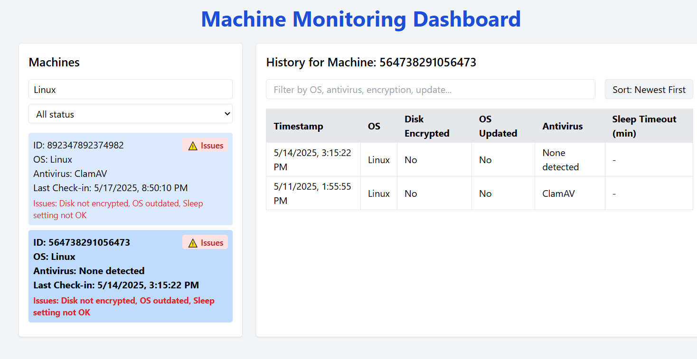

# Intern Assignment: Cross-Platform System Utility + Admin Dashboard

# 🖥️ Machine Monitoring Dashboard

A web-based dashboard to monitor machine health, including security settings, software status, and system configurations.

---

## 🚀 Features

### 🔍 Machine Overview Panel
- **Filter by OS** (e.g., Linux)
- **Filter by Status** (e.g., All status, Issues only)
- Displays:
  - Machine ID
  - OS
  - Antivirus
  - Last Check-in Time
  - Highlighted **Issues**

### 📊 Machine History Section
- Shows a detailed log of the selected machine.
- Information includes:
  - Timestamp
  - OS Version
  - Disk Encryption Status
  - OS Update Status
  - Antivirus Detection
  - Sleep Timeout Setting

### 🛑 Issue Detection
- Issues such as:
  - Disk not encrypted
  - Outdated OS
  - Incorrect sleep settings
- Clearly marked with an **"⚠️ Issues"** badge for quick visibility.

### 🧭 Sorting & Filtering
- Search and filter historical data by:
  - OS
  - Antivirus
  - Encryption status
  - Update status
- Sort options (e.g., newest first)

---

## 🧩 Technologies Used

- **Frontend**: React.js / HTML / CSS
- **Backend**: Node.js / Express.js
- **Utility**: Python scripts for system diagnostics
- **Database**: MongoDB (Atlas)

---